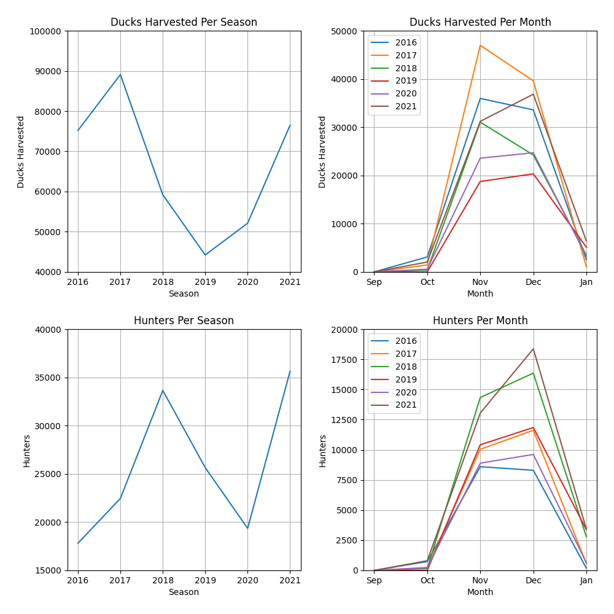

# MOWHarvester
Using Python and Jupyter Notebooks to analyze Missouri waterfowl harvest data collected by the state of Missouri. The data is pulled from https://extra.mdc.mo.gov/widgets/wtrfwl_harvest/. Current Missouri waterfowl hunting regulations can be found here: https://mdc.mo.gov/hunting-trapping/species/waterfowl.

## MDC Harvest Reports
Taken from their website:

"Harvest summaries are compiled from throughout Missouri twice a week from late October until mid-January. They are usually compiled by areas on the Monday and Thursday of each week although activities at each area may affect when statistics are compiled. Marais Temps Claire only hunts Friday-Monday. NOTE: There will be no reports for days when an area is closed or has no hunters."

The areas include:

11. BK Leach CA
12. Bob Brown CA
13. Columbia Bottom CA
14. Duck Creek CA
15. Eagle Bluffs CA
16. Fountain Grove CA
17. Four Rivers CA
18. Grand Pass CA
19. Marais Temps Clair CA
21. Montrose CA
22. Nodaway Valley CA
23. Otter Slough CA
26. Ted Shanks CA
27. Ten Mile Pond CA

## Preview

A simple example of the type of information we can get from the data.

### Overview

Combination of all of the graphs.

### Ducks Per Season

### Ducks Per Month

### Hunters Per Season

### Hunters Per Month

## References
Able to use the following websites/apis for specific data

* Coordinates based on zip code: https://public.opendatasoft.com/explore/dataset/us-zip-code-latitude-and-longitude/table/

